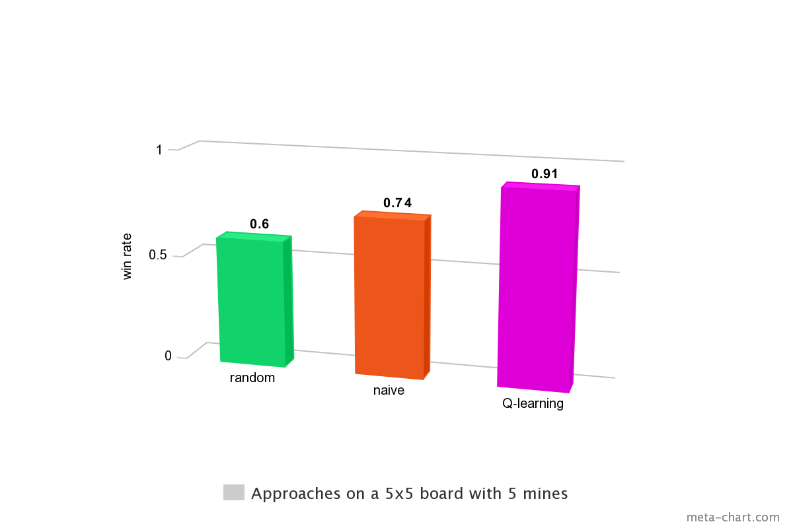
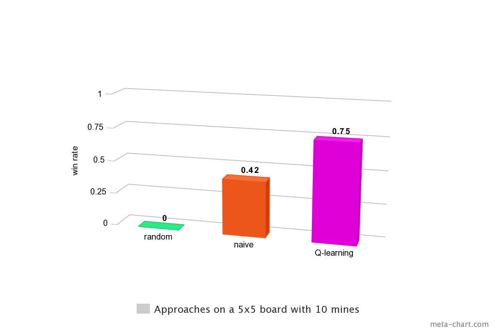
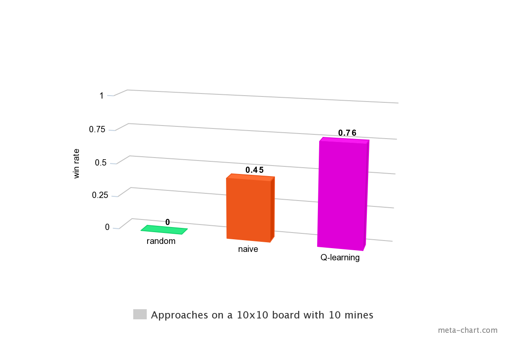

## Project Summary
It's a minesweeper solver! It can solve any board, with any size, and exactly compute every cell's chance of being a mine. It achieves this through advanced combinatorial and probability analysis with artificial intelligence. The project will use random search as the baseline algorithm, naive search as the intermediate algorithm and Q-Learning as the advancing algorithm.   

### What is Minesweeper?
Just in case you don't know how the game works: Minesweeper is a single-player puzzle game avaliable on several avaliable operating systems and GUIs. At the start of the game, the player receives a  rectangular grid of covered cells. Each turn, player may probe or uncover a cell revealing either a mine or an integer. This integer indicates the number of mines adjacent to the particular cell. As such, the number ranges from 0 to 8, since it's impossible for a cell to have more than eight neighbors. The game ends when player probes a cell containing a mine (lose), or uncovered every cell that does not contain a mine (win).
#### Game Setup:

|   Board With Cover        |  Board Without Cover      |
|:-------------------------:|:-------------------------:|
|  |  |
  
  
#### Video
  
<iframe width="1000" height="720" src="https://www.youtube.com/embed/9oHDoS7__8o" frameborder="0" allow="accelerometer; autoplay; encrypted-media; gyroscope; picture-in-picture" allowfullscreen></iframe>
  
  
## Approach

  **_Random Search_**  
  
You might realize that this is basically the most stupid way to find solution to the game.  
Data for random search approach is generated in the following manner. Each tile in the game board is a Tile class. All the tiles are stored in a 2-dimensional list, and their locations, in terms of row and column, are represetned by list index. 
Random search will keep generating two random integer as the location of next tile to be uncovered until the tile is guaranteed to be inside the board and staying covered. 
```
#Alogrithm 1 sweep_random
while not game over do:
   while True:
      randomly select a tile
      if the tile is covered and the cell is inside the board:
         sweep the tile
         return the tile's location
      end if
end while
```

  **_Naive Search_**

  
Data for Naive search approach is generated in the following manner. Each tile can be represented as a feature with an integer determined by the tile state in current board. If the tile is uncovered, the corresponding feature is represented by the number of mines to which the square is adjacent. The integer value is stored in _tile_ class as _COUNTER_ attribute. If the tile is uncovered, _COUNTER_ attribute will be set to 0 by default since it does not provide any information. And the _tile_ class also stores whether the tile is visible to the player with an _visible_ value.  

<p align="center"> 

</p>

At each state the game, the naive search stores all tiles that are not visible, but are adjacent to visible tiles in perimeter. Moves are chosen randomly from tiles within the perimeter with some fixed probability, and otherwise just use random search. This method models normal game play where most moves are selected from the perimeter of the current board. However, our algorithms do not flag tiles indicating a mine is present like in real life; they only predict whether a tile is suitable to be a next move. The general greedy algorithm for naive_search is presented below:

```
while not game over do:
   for all the tiles in the current board:
      if the tile is invisible and the tile is adjacent to visible tiles:
         add the tile to primeter
         get surronding tiles of the current tile
         calculate probability of the current tile being a mine
      end if
   choose a tile with minimum probability of being a mine. 
   sweep the tile
end while
```
  **_Q-Learning_**

One approach is to model Minesweeper game as an Markov Decision Process and use a modified version of Q-Learning to discover the best moves for each given board state. After learning the Q values, the algorithm would then use rewards obtained to play the game. 

<p align="center"> 

</p>

This is a standard Q-Learning algorithm form. This function allows the algorithm to learn not just about the direct reward of a particular action, but also a particular action is more likely to lead to reward in a long-term. However, while common chess games are more concerned with endgame result, minesweeper is more interested in intermediate reward: whether the tile contains a mine. Therefore, to better approximate this reward, we remove dicount factor and estimate of optimal future value:

<p align="center"> 

</p>

By giving reward for choosing a mine tile to be a negative number (for example, -1), and that of choosig a non-mine tile to be a positive numebr(1), we are able to find the tile which is least likely to be a mine with the highest Q value.

```
while not game over do:
   s = current state of the board
   sweep at random location
   if tile is mine:
      r = -1
   else:
      r = 1
   end if 
   Q(s,a) = (1-alpha)*Q(s,a) + alpha(r)
end while
```

## Evaluation
We use win rate as the most important metric to understand how our approaches perform in playing Minesweeper:

<pre>      5x5 5 mines                           5x5 10 mines                   10x10 10 mines         </pre>

<p float="center">
  
   
  
</p>

Three approaches are tested on two boards with different size and mine density. In the 5x5 board with 5 mines, all approaches exhibit moderate success; the Q-Learning approaches with almost 100% accuracy. However, the performance of three approaches drops after the mine density increases. This is reasonable since, when playing Minesweeper, the game will automatically flip any adjcent non-mine tiles. Lower mine density also means fewer chances to make decision. For method like random choose, it is almost impossible for it to consecutively choose correct tiles. 

## Remaining Goals and Challenges

In next few weeks, we will improve our Q-Learning algorithm, since for now it covers all the moves, which makes the algorithm kind of slow. One solution is to filter out tiles that are visible or are mines. We also plan to develop more models for calculation of probability in naive choose algorithm. In this part, we can use logistic regression as well as an SVM classifier for predicting uncovered tiles. 

We are also improving on evaluation metrics. Win rate is essential but it does not cover all the respects. We will use testing accuracy, which tells how well our classifier models perform, and the average percentage of the board uncovered. We need to plot three metrics because win rate alont can be misleading: Q-Learning algorithm must take consecutive correct predictions to win; but the game logistics provide a scenario that one can click on one tile and clean a very large area. In this situation, the average percentage of the board uncovered might be helpful. 

## Resources Used

see /docs/references  

charts are made in https://www.meta-chart.com  
block images are provided by https://www.minecraftinfo.com  
video is made by iMovie and QuickTimePlayer  
